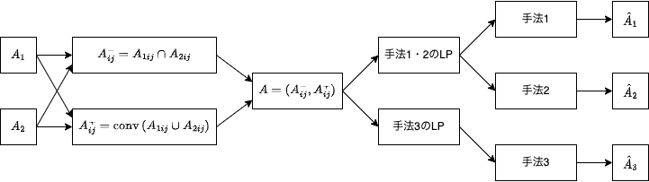

# **2022/11/17**

石川健太郎

---

### $a_{ij}^{\text{L}-} := \frac{a_{ij}^{\text{L}-} w_j^\text{U} + \varepsilon_{ij}^{\text{L}-} + \varepsilon_{ij}^{\text{L}+}}{w_j^\text{U}}$について

$\varepsilon_{ij}^{\text{L}-}, \varepsilon_{ij}^{\text{L}+}$ の少なくとも一方は $0$ であることが保証されている
（ $a_{ij}^{\text{L}+} \leq a_{ij}^{\text{L}-}, ~~ i, j \in N$ なので）

式(26)の一部 $a_{ij}^{\text{L}+} w_j^\text{U} - \varepsilon_{ij}^{\text{L}+} \leq w_i^\text{L} \leq a_{ij}^{\text{L}-} w_j^\text{U} + \varepsilon_{ij}^{\text{L}-}$ について考える

- $\varepsilon_{ij}^{\text{L}+} = 0, ~~ \varepsilon_{ij}^{\text{L}-} \not= 0$ の場合
    - $w_i^\text{L} = a_{ij}^{\text{L}-} w_j^\text{U} - \varepsilon_{ij}^{\text{L}-}$
- $\varepsilon_{ij}^{\text{L}+} \not= 0, ~~ \varepsilon_{ij}^{\text{L}-} = 0$ の場合
    - $a_{ij}^{\text{L}+} w_j^\text{U} - \varepsilon_{ij}^{\text{L}+} = w_i^\text{L}$
- $\varepsilon_{ij}^{\text{L}+} = \varepsilon_{ij}^{\text{L}-} = 0$ の場合
    - 修正なし

---

### 修正のパターン

- $\varepsilon_{ij}^{\text{L}+} = 0, ~~ \varepsilon_{ij}^{\text{L}-} \not= 0$ の場合
    - $w_i^\text{L} = a_{ij}^{\text{L}-} w_j^\text{U} - \varepsilon_{ij}^{\text{L}-}$
- $\varepsilon_{ij}^{\text{L}+} \not= 0, ~~ \varepsilon_{ij}^{\text{L}-} = 0$ の場合
    - $a_{ij}^{\text{L}+} w_j^\text{U} - \varepsilon_{ij}^{\text{L}+} = w_i^\text{L}$
- $\varepsilon_{ij}^{\text{L}+} = \varepsilon_{ij}^{\text{L}-} = 0$ の場合
    - 修正なし

---

### 手法1・2のLP

$$
\begin{align*}
    \text{minimize} ~~
    & \sum_{i \in N} \left( \varepsilon_i^\text{L} + \varepsilon_i^\text{U} \right), \\
    \text{subject to} ~~
    & a_{ij}^{\text{L}+}w_j^\text{U} - \varepsilon_i^\text{L} \leq
    w_i^\text{L} \leq
    a_{ij}^{\text{L}-}w_j^\text{U} + \varepsilon_i^\text{L}, ~~ i, j \in N, ~~ i \not= j, \\
    & a_{ij}^{\text{U}-}w_j^\text{L} - \varepsilon_i^\text{U} \leq
    w_i^\text{U} \leq
    a_{ij}^{\text{U}+}w_j^\text{L} + \varepsilon_i^\text{U}, ~~ i, j \in N, ~~ i \not= j, \\
    & \varepsilon_i^\text{L} \geq w_i^{\text{L}+} - w_i^{\text{L}-}, ~~
    \varepsilon_i^\text{U} \geq w_i^{\text{U}-} - w_i^{\text{U}+}, ~~ i \in N, \\
    & w_i^{\text{L}-} \leq a_{ij}^{\text{L}-}w_j^\text{U}, ~~
    w_i^{\text{L}+} \geq a_{ij}^{\text{L}+}w_j^\text{U}, ~~ i, j \in N, ~~ i \not= j, \\
    & w_i^{\text{U}-} \geq a_{ij}^{\text{U}-}w_j^\text{L}, ~~
    w_i^{\text{U}+} \leq a_{ij}^{\text{U}+}w_j^\text{L}, ~~ i, j \in N, ~~ i \not= j, \\
    & \sum_{i \in N\backslash\{ j \}} w_i^\text{U} + w_j^\text{L} \geq 1, ~~
    \sum_{i \in N\backslash\{ j \}} w_i^\text{L} + w_j^\text{U} \leq 1, ~~ j \in N, \\
    & w_i^\text{U} \geq w_i^\text{L} \geq \epsilon, ~~ i \in N, ~~
    w_i^{\text{L}+}, w_i^{\text{L}-}, \varepsilon_i^\text{L},
    w_i^{\text{U}-}, w_i^{\text{U}+}, \varepsilon_i^\text{U} \geq 0, ~~ i \in N
\end{align*}
$$

---

### 手法1

次の方法でPCM $A$ を $\hat{A}$ に更新する

$$
\hat{a}_{ij}^{\text{L}-} = \max\left( a_{ij}^{\text{L}-}, \frac{w_i^{\text{L}-} + \varepsilon_i^\text{L}}{w_j^{\text{U}-} - \varepsilon_j^\text{U}} \right), ~~
i, j \in N, ~~ i \not= j, \\
\hat{a}_{ij}^{\text{U}-} = \min\left( a_{ij}^{\text{U}-}, \frac{w_i^{\text{U}-} - \varepsilon_i^\text{U}}{w_j^{\text{L}-} + \varepsilon_j^\text{L}} \right), ~~
i, j \in N, ~~ i \not= j, \\
\hat{a}_{ij}^{\text{L}+} = \min\left( a_{ij}^{\text{L}+}, \frac{w_i^{\text{L}+} - \varepsilon_i^\text{L}}{w_j^{\text{U}+} + \varepsilon_j^\text{U}} \right), ~~
i, j \in N, ~~ i \not= j, \\
\hat{a}_{ij}^{\text{U}+} = \max\left( a_{ij}^{\text{U}+}, \frac{w_i^{\text{U}+} + \varepsilon_i^\text{U}}{w_j^{\text{L}+} - \varepsilon_j^\text{L}} \right), ~~
i, j \in N, ~~ i \not= j \\
$$

---

### 手法2

次の方法でPCM $A$ を $\hat{A}$ に更新する

$$
\hat{a}_{ij}^{\text{L}-} = \max\left( a_{ij}^{\text{L}-}, \frac{w_i^{\text{L}+}}{w_j^\text{U}}, \frac{w_i^\text{L}}{w_j^{\text{U}+}} \right), ~~
i, j \in N, ~~ i \not= j, \\
\hat{a}_{ij}^{\text{U}-} = \min\left( a_{ij}^{\text{U}-}, \frac{w_i^{\text{U}+}}{w_j^\text{L}}, \frac{w_i^\text{U}}{w_j^{\text{L}+}} \right), ~~
i, j \in N, ~~ i \not= j, \\
\hat{a}_{ij}^{\text{L}+} = \min\left( a_{ij}^{\text{L}+}, \frac{w_i^{\text{L}-}}{w_j^\text{U}}, \frac{w_i^\text{L}}{w_j^{\text{U}-}} \right), ~~
i, j \in N, ~~ i \not= j, \\
\hat{a}_{ij}^{\text{U}+} = \max\left( a_{ij}^{\text{U}+}, \frac{w_i^{\text{U}-}}{w_j^\text{L}}, \frac{w_i^\text{U}}{w_j^{\text{L}-}} \right), ~~
i, j \in N, ~~ i \not= j \\
$$

---

### 手法3のLP

$$
\begin{align*}
    \text{minimize} ~~
    & \sum_{i, j \in N, ~ i \not= j} \left( \varepsilon_{ij}^{\text{L}-} + \varepsilon_{ij}^{\text{U}-} +
    \varepsilon_{ij}^{\text{L}+} + \varepsilon_{ij}^{\text{U}+} \right), \\
    \text{subject to} ~~
    & a_{ij}^{\text{L}+} w_j^\text{U} - \varepsilon_{ij}^{\text{L}+} \leq w_i^\text{L} \leq
    a_{ij}^{\text{L}-} w_j^\text{U} + \varepsilon_{ij}^{\text{L}-}, ~~
    i, j \in N, ~~ i \not= j, \\
    & a_{ij}^{\text{U}-} w_j^\text{L} - \varepsilon_{ij}^{\text{U}-} \leq w_i^\text{U} \leq
    a_{ij}^{\text{U}+} w_j^\text{L} + \varepsilon_{ij}^{\text{U}+}, ~~
    i, j \in N, ~~ i \not= j, \\
    & \sum_{j \in N\backslash\{ j \}} w_j^\text{U} + w_i^\text{L} \geq 1, ~~
    \sum_{j \in N\backslash\{ j \}} w_j^\text{L} + w_i^\text{U} \leq 1, ~~ i \in N, \\
    & w_i^\text{U} \geq w_i^\text{L} \geq \epsilon, ~~ i \in N, ~~
    \varepsilon_{ij}^{\text{L}-}, \varepsilon_{ij}^{\text{U}-}, \varepsilon_{ij}^{\text{L}+}, \varepsilon_{ij}^{\text{U}+} \geq 0, ~~
    i, j \in N, ~~ i \not= j
\end{align*}
$$

---

### 手法3

次の方法でPCM $A$ を $\hat{A}$ に更新する．
$$
\hat{a}_{ij}^{\text{L}-} = \max\left( a_{ij}^{\text{L}-} + \frac{\varepsilon_{ij}^{\text{L}-}}{w_j^\text{U}}, ~~
\left( a_{ji}^{\text{U}-} - \frac{\varepsilon_{ji}^{\text{U}-}}{w_i^\text{L}} \right)^{-1} \right), ~~
i, j \in N, ~~ i \not= j, \\
\hat{a}_{ij}^{\text{U}-} = \min\left( a_{ij}^{\text{U}-} - \frac{\varepsilon_{ij}^{\text{U}-}}{w_j^\text{L}}, ~~
\left( a_{ji}^{\text{L}-} + \frac{\varepsilon_{ji}^{\text{L}-}}{w_i^\text{U}} \right)^{-1} \right), ~~
i, j \in N, ~~ i \not= j, \\
\hat{a}_{ij}^{\text{L}+} = \min\left( a_{ij}^{\text{L}+} - \frac{\varepsilon_{ij}^{\text{L}+}}{w_j^\text{U}}, ~~
\left( a_{ji}^{\text{U}+} + \frac{\varepsilon_{ji}^{\text{U}+}}{w_i^\text{L}} \right)^{-1} \right), ~~
i, j \in N, ~~ i \not= j, \\
\hat{a}_{ij}^{\text{U}+} = \max\left( a_{ij}^{\text{U}+} + \frac{\varepsilon_{ij}^{\text{U}+}}{w_j^\text{U}}, ~~
\left( a_{ji}^{\text{L}+} - \frac{\varepsilon_{ji}^{\text{L}+}}{w_i^\text{U}} \right)^{-1} \right), ~~
i, j \in N, ~~ i \not= j, \\
$$

---

### 処理の流れ

実際の処理は上記の流れに桁落ちした数値の大小関係の補正や不正な形式の入力を弾く処理を加えたもの

---

- キャンセリングで $\hat{A}_{ij}^- = \emptyset$ になるのはどんな場合か
    - crispな元となるPCM → 2つの区間PCMの場合には元のPCMに推移律が成り立たない場合
    - 例えば元のPCMが $\begin{bmatrix} 1 & 2 & 2 \\ 1/2 & 1 & 1/2 \\ 1/2 & 2 & 1 \end{bmatrix}, ~~ (\text{CI} \approx 0.027)$ の場合

- $A$ の作成において特定の比較についてそれぞれが上/下にぶれただけで内側が $\emptyset$ になる
    - 例えば $[0.8, 0.9], [1, 1.1]$ は共通部分がない
        - この場合他が全く同じでもLPが実行できない（空集合への対応は未定義）
    - 似た意見とは？

- 手法1→手法2→手法3の順で内が空集合になりづらくなっている
    - キャンセルが多い順

- $A_1, A_2$ はどんな行列?
    - 一般的な区間一対比較行列がどんなものなのか分からない
